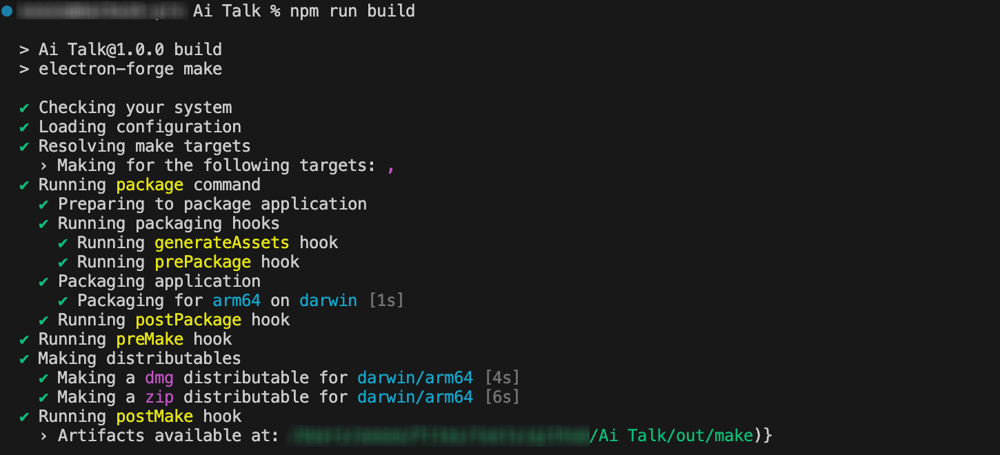
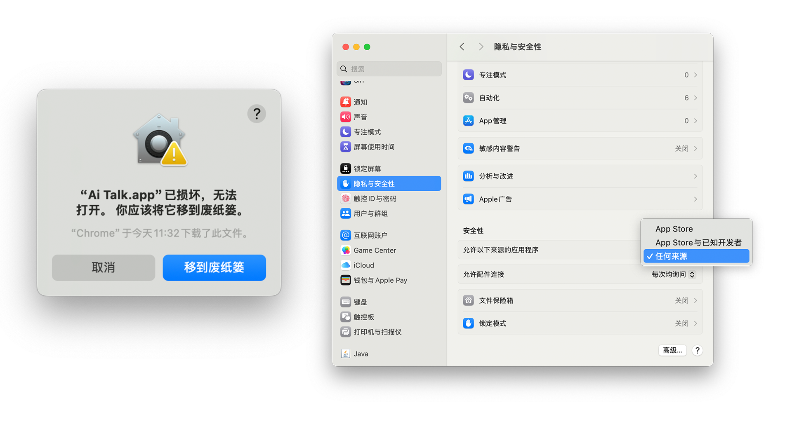

# **<span style="font-size: 30px; vertical-align: middle;">Ai Talk</span>**


<p align="left">
  
  
  
  
  
</p>

## 📔 简介

**Ai Talk** 是一款基于 Electron 框架开发的开源桌面客户端，集成了多个主流大语言模型与实用应用入口。当前支持的大模型入口包括：DeepSeek、通义千问、元宝、豆包、Kimi、文心一言、ChatGPT、Gemini、Perplexity、Claude、Poe、Manus、Grok、Meta、Sciencepal 以及 Copilot。其他应用入口：DeepL Translator、有道翻译和 Bing。

</br>

> 📑   **Note：** 国内用户使用 Chatgpt、Gemini、Perplexity、Claude、Poe、Manus、Grok、Meta、Copilot 需要设置网络代理才能正常访问。

</br>

## 📟 功能介绍

### 基本使用

程序界面主要分为两个部分：“左侧侧边栏” 与 “右侧内容显示区”。当点击侧边栏中的某个大模型图标时，右侧区域将自动载入该模型的官方网页界面。登录个人账户后，即可直接在该页面内进行对话与交互。


**网络代理：** 由于 **ChatGPT**、**Gemini**、**Perplexity**、**Claude**、**Poe**、**Manus**、**Grok**、**Meta AI**、**Copilot** 等模型网络限制，因此国内用户使用之前，需要在左侧侧边栏下方的 "网络设置" 中配置代理网络。目前只支持 **HTTP** 和 **HTTPS** 协议。配置步骤如下：

> - 点击 “网络设置” ，在弹窗输入代理地址，如：本地开启了 7890 端口为代理网络端口，填入 http://127.0.0.1:7890 
> - 点击 “设置代理” ，完成网络设置
> - 如网络设置输入错误，点击 “清除代理” 即可恢复程序默认设置
> - 设置完毕后点击 “关闭” 再次点击模型图标进行访问即可


### 会话分身

此前版本仅支持单一会话，无法方便地对比不同模型的回答，也不能直接访问模型输出中的参考链接。新增的 **会话分身功能** 有效解决了这些限制。在当前版本中，用户可以**通过会话分身同时打开多个模型会话**。


该版本支持直接访问模型回答中的参考链接，用户可在当前应用内直接跳转浏览，无需额外启动浏览器。


为方便轻办公与信息检索，该版本也引入了 Bing 搜索入口，可以直接在当前程序实现类浏览器搜索


## ⌨️ 源码启动

- 安装 nodejs

```
https://nodejs.org/zh-cn/download
```

- 下载项目源码

```
git clone https://github.com/Funsiooo/Ai-Talk.git
```

- 安装 electron

```
cd Ai-Talk
npm install electron --save-dev -d --registry=https://registry.npmmirror.com
```


- Ai Talk 目录下执行

```
npm start
```

<br/>


## 📦 打包

- 安装 node.js

```
https://nodejs.org/zh-cn/download
```

- 下载项目源码

```
git clone https://github.com/Funsiooo/Ai-Talk.git
```

- 安装 electron

```
cd Ai-Talk
npm install electron --save-dev -d --registry=https://registry.npmmirror.com
```

- 安装 electron-forge/cli

```
npm install --save-dev @electron-forge/cli -d --registry=https://registry.npmmirror.com
```

- macos 安装 @electron-forge/maker-dmg

```
npm install --save-dev  -d @electron-forge/maker-dmg --registry=https://registry.npmmirror.com
```

- Ai Talk 目录下执行，打包文件存放在 out 目录下（打包过程中若出现报错可忽略，若打包失败，可以尝试执行 `npm cache clean --force` 命令清理缓存，随后重新运行所有的打包命令）

```
npm run build
```
> 📑   **Note：** 自行打包需要根据自身设备替换项目中的 package.json 文件, 目前提供 **Mac Apple silicon**、**Windows** 打包文件, 文件见 config 文件夹。



<br/>

## 🛎️ FQA

Mca 用户在下载安装 [Ai.Talk-1.0.2-arm64.dmg](https://github.com/Funsiooo/Ai-Talk/releases/download/v1.0.2/Ai.Talk-1.0.2-arm64.dmg) 后出现报错。这是由于新版 macOS 系统默认禁止安装第三方未验证的应用，且系统隐藏了“任何来源”的选项。用户需先在终端执行以下命令，重新启用该选项，之后再次打开应用即可正常使用。

```
sudo spctl --master-disable
```



# aichat
# aichat
# aichat
