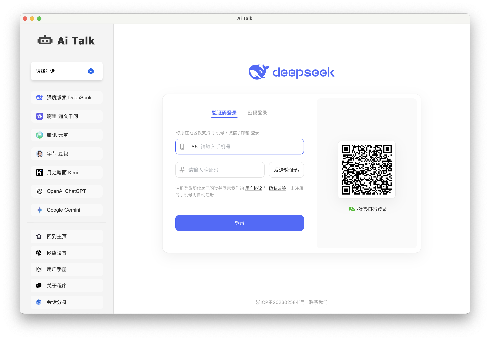
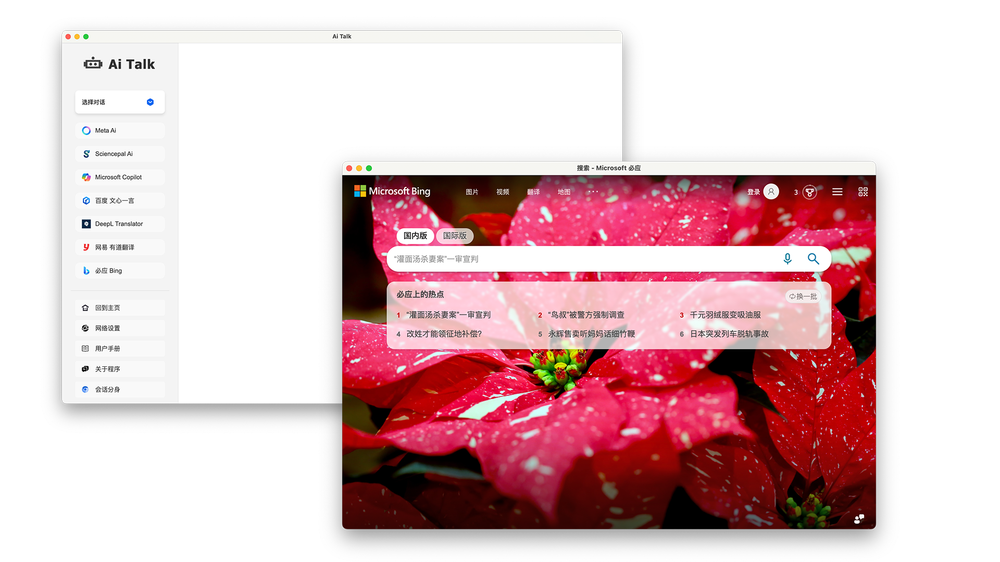

# **<span style="font-size: 30px; vertical-align: middle;">Ai Talk</span>**


<p align="left">
  
  
  
  
  
</p>
## 📔  Introduction

**Ai Talk** is an open-source desktop client built on the Electron framework, integrating multiple mainstream large language models and practical application gateways. Currently supported large language models include: DeepSeek, Tongyi Qianwen, Yuanbao, Doubao, Kimi, Wenxin Yiyuan, ChatGPT, Gemini, Perplexity, Claude, Poe, Manus, Grok, Meta, Sciencepal, and Copilot. Additional application access points: DeepL Translator, Youdao Translation, and Bing. [[Chinese Readme\]](https://github.com/Funsiooo/Ai-Talk/README.md)


## 📟 Program Introduction

### Basic Usage

The program interface is primarily divided into two sections: the “left sidebar” and the “right content display area.” When you click an icon for a large model in the sidebar, the right area will automatically load that model's official webpage interface. After logging into your personal account, you can directly engage in conversations and interactions within that page.




**Network Proxy:** Currently only supports **HTTP** and **HTTPS** protocols. The configuration steps are as follows:

> - Click "网络设置" and enter the proxy address in the pop-up window. For example, if port 7890 is enabled locally as the proxy network port, enter [http://127.0.0.1:7890](http://127.0.0.1:7890/)
> - Click "设置代理" to complete the network settings
> - If the network settings are entered incorrectly, click "清除网络" to restore the program default settings
> - Click "关闭" after setting.


### Split Sessions

Previous versions only supported single sessions, making it inconvenient to compare responses from different models and preventing direct access to reference links within model outputs. The newly added **Split Sessions feature** effectively addresses these limitations. In the current version, users can **open multiple model sessions simultaneously using Split Sessions**.

This version supports direct access to reference links within model responses, allowing users to navigate directly within the current application without launching an additional browser.


To facilitate lightweight office tasks and information retrieval, this version also introduces a Bing search portal, enabling browser-like searches directly within the current application.



## ⌨️  Source code startup

- Install nodejs

```
https://nodejs.org/zh-cn/download
```

- Download project source code

```
git clone https://github.com/Funsiooo/Ai-Talk.git
```

- Install electron

```
cd Ai-Talk
npm install electron --save-dev -d --registry=https://registry.npmmirror.com
```


- Execute in Ai Talk directory

```
npm start
```

<br/>


## 📦 To package

- Install node.js

```
https://nodejs.org/zh-cn/download
```

- Download project source code

```
git clone https://github.com/Funsiooo/Ai-Talk.git
```

- Install electron

```
cd Ai-Talk
npm install electron --save-dev -d --registry=https://registry.npmmirror.com
```

- Install electron-forge/cli

```
npm install --save-dev @electron-forge/cli -d --registry=https://registry.npmmirror.com
```

- macos install @electron-forge/maker-dmg

```
npm install --save-dev  -d @electron-forge/maker-dmg --registry=https://registry.npmmirror.com
```

- Execute commands in the Ai Talk directory. Packaged files are stored in the out directory. If errors occur during packaging, you may ignore them. If packaging fails, try running the command `npm cache clean --force` to clear the cache, then rerun all packaging commands.

```
npm run build
```

> 📑 **Note：** To package by yourself, you need to replace the package.json file in the project according to your own device. Currently, **Mac Apple silicon** and **Windows** packaging files are provided. The files can be found in the config folder.


